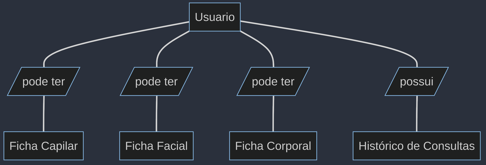

 # Especificações do Projeto

Percebe-se que há uma falta de organização que está prejudicando a eficiência no trabalho, especialmente no preenchimento manual das fichas de anamnese dos clientes, que consomem muito tempo. Essas fichas são essenciais para compreender as necessidades e histórico médico dos clientes. Além disso, ela enfrenta dificuldades na organização do histórico de atendimentos e deseja poder acessá-los rapidamente. Outra lacuna é a ausência de fichas de cadastro para cada cliente, atualmente mantidas em papel, dificultando a localização quando necessário.

## Arquitetura e Tecnologias

As tecnologias utilizadas serão:

- Node.JS
https://nodejs.org/en
- Prisma
https://www.prisma.io/
- Postgres
https://www.postgresql.org/
- Fastify
https://fastify.io/
- React.JS
https://react.dev/
- Ant Design 5.0
https://ant.design/

Segue abaixo a lógica da arquitetura:

Algumas ferramentas:

- Visual studio code
- Postman
- Figma

## Project Model Canvas

> **Links Úteis**:
> Disponíveis em material de apoio do projeto

## Requisitos

As tabelas que se seguem apresentam os requisitos funcionais e não funcionais que detalham o escopo do projeto. Para determinar a prioridade de requisitos, aplicar uma técnica de priorização de requisitos e detalhar como a técnica foi aplicada.

### Requisitos Funcionais

|ID    | Descrição do Requisito  | Prioridade |
|------|-----------------------------------------|----|
|RF-001| O sistema permitirá o cadastro do cliente pela esteticista | MÉDIA |
|RF-002| O sistema possuirá questionário de saúde para preenchimento do cliente | ALTA |
|RF-003| O sistema deverá gerar um link que possa ser compartilhado com o cliente para acessar o questionário de saúde | MÉDIA |
|RF-004| O sistema permitirá o cadastro de consultas feitas pela esteticista | ALTA |
|RF-005| O sistema permitirá o acesso do histórico de consultas do cliente de estética alimentado pelas consultas cadastradas | ALTA |
|RF-006| O sistema deverá ter uma metodologia de busca, para localizar o cadastro dos clientes de estética | ALTA |
|RF-007| O sistema permitirá que as fichas facial e corporal de sejam editadas pela esteticista | ALTA |
|RF-008| O sistema deverá destacar as informações mais relevantes no histórico de cada cliente | MÉDIA |
|RF-009| O sistema deverá possuir um login para a esteticista acessar a plataforma | MÉDIA |
|RF-010| O sistema deverá exibir a agenda de disponibilidade da esteticista para realização de procedimentos | BAIXA |
|RF-011| O sistema possuirá ficha facial para preenchimento da esteticista | ALTA |
|RF-012| O sistema possuirá ficha corporal para preenchimento da esteticista | ALTA |

### Requisitos não Funcionais

|ID     | Descrição do Requisito  |Prioridade |
|-------|-------------------------|----|
|RNF-001| O sistema possuirá responsividade para atender todos os dispositivos homologados | ALTA |
|RNF-002| O sistema deverá operar em navegadores WEB | ALTA |
|RNF-002| O sistema deverá seguir as normas da LGPD | ALTA |

## Restrições

O projeto está restrito pelos itens apresentados na tabela a seguir.

|ID| Restrição                                             |
|--|-------------------------------------------------------|
|01| O projeto deverá ser entregue até o final do semestre |
|02| Não pode ser desenvolvido um módulo de backend        |

## Diagrama de Casos de Uso

## Modelo ER (Projeto Conceitual)

## Entidades
* **Usuario:** Representa os usuários do sistema. Podem ser administradores ou clientes.

* **Fichas (Capilar, Facial, Corporal):**  Categorias específicas de fichas de anamnese, cada uma destinada a um tipo de procedimento estético. Estas entidades armazenam informações pertinentes aos procedimentos capilares, faciais e corporais, respectivamente.

* **HistoricoDeConsultas:** Mantém um registro detalhado de todas as consultas realizadas pelo usuário, incluindo uma descrição da consulta, observações adicionais e as datas de criação e atualização. Esta entidade é crucial para o acompanhamento contínuo do histórico clínico e estético do cliente.

## Relações
**Usuario "pode ter" FichaCapilar:** Cada usuário pode ter múltiplas fichas de anamnese capilar associada a ele

**Usuario "pode ter" FichaFacial:** Cada usuário pode ter múltiplas fichas de anamnese facial associada a ele.

**Usuario "pode ter" FichaCorporal:** Cada usuário pode ter múltiplas fichas de anamnese corporal associada a ele

**Usuario "contém" HistoricoDeConsulta:** Este relacionamento mostra que toda vez que o cliente recebe um atendimento na clínica de estética, um registro é criado com informações relevantes.

**Usuario "contém" QuestionarioDeSaude:** Este relacionamento mostra que os usuarios do tipo cliente precisam preencher o questionário de saúde.

Este diagrama conceitual fornece uma visão simplificada e abstrata do modelo de dados, focando na estrutura e nas relações principais.

## Projeto da Base de Dados

## Entidades e Campos

### `Usuario`
- **Descrição**: Representa os usuários do sistema, incluindo tanto administradores quanto clientes. Contém informações pessoais e de contato, além de dados administrativos.
- **Campos**:
  - `id`: Identificador único para cada usuário.
  - `nome`: Nome completo do usuário.
  - `dataDeNascimento`: Data de nascimento do usuário.
  - `endereco`: Endereço residencial do usuário.
  - `estado_civil`: Estado civil do usuário (Casado, Solteiro, Divorciado).
  - `email`: E-mail de contato do usuário.
  - `telefone`: Número de WhatsApp do usuário.
  - `sexo`: Sexo do usuário (Masculino / Feminino).
  - `tipo_usuario`: Tipo de usuário (Admin, Cliente), definindo seu papel no sistema.
  - `criado_em`: Data de criação do registro do usuário.
  - `atualizado_em`: Data da última atualização do registro do usuário.

### `FichaCapilar`, `FichaFacial`, `FichaCorporal`
- **Descrição**: Estas entidades representam as fichas de anamnese específicas para cada tipo de procedimento estético (capilar, facial, corporal), armazenando informações pertinentes a cada um.
- **Campos Comuns**:
  - `id`: Identificador único para cada ficha de anamnese.
  - `usuarioId`: Chave estrangeira referenciando o usuário associado à ficha.
  - `perguntas`: aqui teremos as mais de 43 perguntas para cada ficha. Não listado por simplificação.
  - `criado_em`: Data de criação da ficha.
  - `atualizado_em`: Data da última atualização da ficha.

### `HistoricoDeConsultas`
- **Descrição**: Mantém registros detalhados de todas as consultas realizadas pelos usuários, incluindo descrições das consultas e observações adicionais.
- **Campos**:
  - `id`: Identificador único para cada registro de consulta.
  - `adminId`: Chave estrangeira referenciando o usuário do tipo admin ao qual a consulta está associada.
  - `clienteId`: Chave estrangeira referenciando o usuário do tipo cliente ao qual a consulta está associada.
  - `descricao`: Descrição detalhada da consulta.
  - `observacoes`: Observações adicionais sobre a consulta, sendo um campo não obrigatório.
  - `criado_em`: Data de criação do registro da consulta.
  - `atualizado_em`: Data da última atualização do registro da consulta.

### `QuetionarioDeSaude`
- **Descrição**: Esta entidade armazena informações relevantes e sensíveis sobre a saúde dos clientes. Apenas o próprio cliente pode preenchê-la e os administradores possuem acesso de leitura apenas.
- **Campos**:
  - `id`: Identificador único para cada questionario.
  - `usuarioId`: Chave estrangeira referenciando o usuário associado à ficha.
  - `perguntas`: aqui teremos perguntas sobre a saúde do cliente.
  - `criado_em`: Data de criação da ficha.
  - `atualizado_em`: Data da última atualização da ficha.

## Relações

- **`Usuario -- FichaCapilar/FichaFacial/FichaCorporal`**: Ilustra que cada usuário pode ter múltiplas fichas de anamnese associadas, uma para cada tipo de procedimento estético (capilar, facial, corporal). Isso permite um acompanhamento detalhado e personalizado para cada cliente.

- **`Usuario -- HistoricoDeConsultas`**: Demonstra que cada usuário possui um histórico de consultas, permitindo um registro detalhado de todos os atendimentos e procedimentos realizados no centro estético.

- **`Usuario -- Questionario de Saude`**: Demonstra que cada usuário (cliente) possui um Questionário de Saúde com informações sensíveis sobre a saúde do cliente.

## Organização

https://trello.com/b/ZWAKW9uy/projeto-est%C3%A9tica

